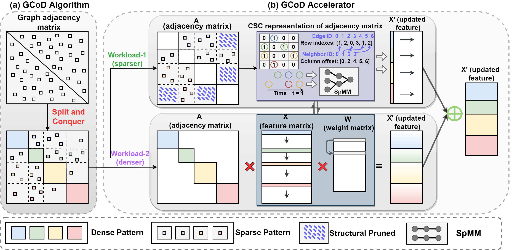
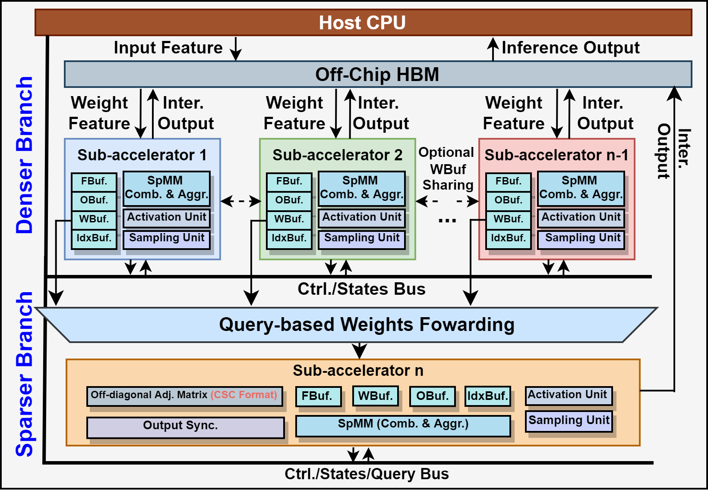

# GCoD: Graph Convolutional Network Acceleration via Dedicated Algorithm and Accelerator Co-Design

[](https://opensource.org/licenses/Apache-2.0)

**Haoran You**, Tong Geng, Yongan Zhang, Ang Li, Yingyan Lin (Also credit to Cheng Wan's help and discussion on graph paritioning)

Accepted by [HPCA 2022](https://hpca-conf.org/2022/). More Info:
\[ [**Paper**](https://arxiv.org/pdf/2112.11594.pdf) | [**Slide**](https://drive.google.com/file/d/1mLBhVV8orRa0RxKMniXUK0FRcmTL2_j4/view?usp=sharing) | [**Youtube**](https://www.youtube.com/watch?v=Zx1sMyzwOtY) | [**Github**](https://github.com/ranery/GCoD) \]

---

## Overview of the Co-Design Framework

We propose a **G**CN algorithm and accelerator **Co**-**D**esign framework dubbed GCoD.

* ***On the algorithm level***, GCoD integrates a split and conquer training strategy to polarize the graphs to be either denser or sparser in local neighborhoods without compromising the model accuracy, resulting in adjacency matrices that have two levels of workload and enjoys largely enhanced regularity and thus ease of acceleration.

* ***On the hardware level***, GCoD integrates a dedicated two-pronged accelerator to leverage GCoD algorithm's resulting graph adjacency matrices for further boosting the acceleration efficiency. Results of the two branches are then aggregated without conflicts.

<p align="center">

</p>

## Usage of the Provided Minimalistic Codebase

> Prerequisite

```shell script
conda install pytorch==1.7.0 torchvision torchaudio cudatoolkit=11.0 -c pytorch
pip install torch-scatter -f https://pytorch-geometric.com/whl/torch-1.7.0+cu110.html
pip install torch-sparse -f https://pytorch-geometric.com/whl/torch-1.7.0+cu110.html
pip install torch-cluster -f https://pytorch-geometric.com/whl/torch-1.7.0+cu110.html
pip install torch-spline-conv -f https://pytorch-geometric.com/whl/torch-1.7.0+cu110.html
pip install torch-geometric
pip install tqdm
pip install ogb
conda install -c dglteam dgl-cuda11.0
```

> Pretrain GCNs on partitioned graphs

````bash
python train.py \
    --model GCN \
    --dataset Cora \
    --partition \
    --device cuda:0 \
    --save_prefix pretrain_partition \
    --quant \
    --enable_chunk_q \
    --num_act_bits 6 \
    --num_wei_bits 6 \
    --num_agg_bits 6
````

More examples are provided in `./scripts/cmd_pretrain.sh`.

Supported models
- GCN
- GAT
- GIN
- GraphSAGE

Supported datasets
- Cora
- CiteSeer
- Pubmed
- NELL

For training on Reddit or larger graphs, please refer to [DeeperGCN](https://github.com/lightaime/deep_gcns_torch) or [BNS-GCN](https://github.com/RICE-EIC/BNS-GCN) and adapt the code accordingly.

> Tuning according to both sparse and polarization/diagonalization regularization terms

````bash
python tune.py \
    --model GCN \
    --dataset Cora \
    --hard \
    --device cuda:4 \
    --save_prefix graph_tune \
    --iteration 1 \
    --ratio_graph 10 \
    --quant \
    --num_bits 16
````

More examples are provided in `./scripts/cmd_tune.sh`.

> Visualization of the Resulting Adjacency Matrix

<p align="center">

</p>

Visualization scripts are provided in `./scripts/cmd_plot.sh`

## Ideas in Hardware Architecture

Below figure illustrates the overall micro-architecture of the GCoD accelerator. For better processing elements (PEs) utilization and reduced off-chip memory access during the performance dominant aggregation phase, GCoD accelerator consists of two separate computing branches with each dedicated to process the denser workload and sparser workload
of GCoD algorithm's resulting adjacency matrices, respectively.

<p align="center">

</p>

## Speedups over Other Platforms

Extensive experiments and ablation studies validate that our GCoD consistently reduces the number of off-chip accesses, leading to speedups of 15286x, 294x, **7.8x**, and **2.5x** as compared to CPUs, GPUs, and prior-art GCN accelerators including [HyGCN](https://arxiv.org/abs/2001.02514) and [AWB-GCN](https://arxiv.org/abs/1908.10834), respectively

<!--  -->


## Citation

If you find this codebase useful to your research, please cite:

````
@inproceedings{you2021gcod,
  title={GCoD: Graph Convolutional Network Acceleration via Dedicated Algorithm and Accelerator Co-Design},
  author={You, Haoran and Geng, Tong and Zhang, Yongan and Li, Ang and Lin, Yingyan},
  booktitle={The 28th IEEE International Symposium on High-Performance Computer Architecture (HPCA-28)},
  year={2022}
}
````